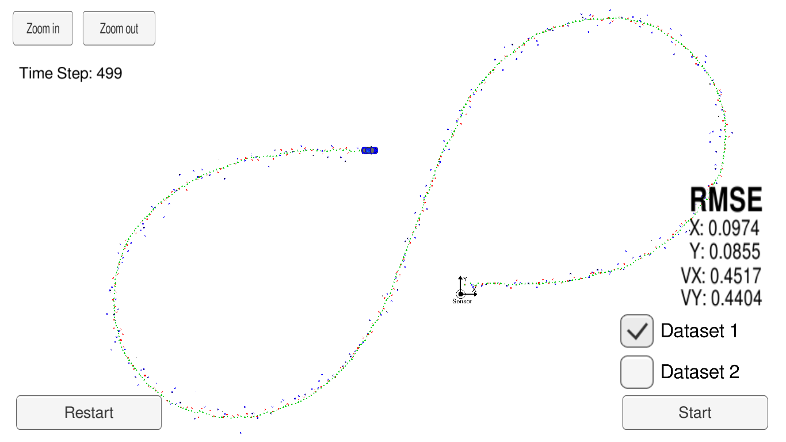
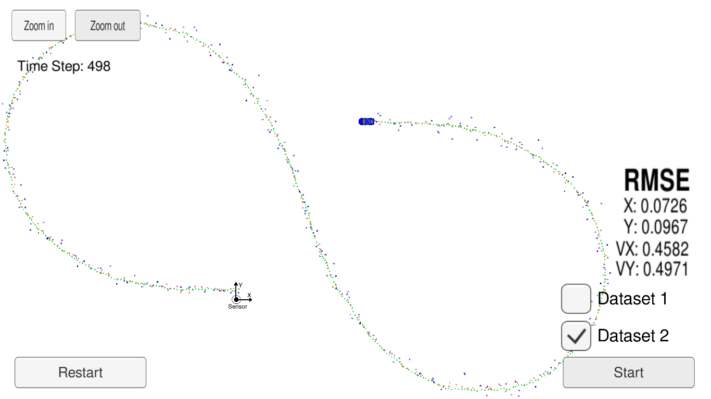

# Vehicle tracking using Extended Kalman Filter
In this project , Extended kalman filter is implemented in C++ to fuse noisy lidar and radar measurements in order to track the position and velocity of a moving vehicle of interest.  
 
This project is done as part of the self-driving car nanodegree .

---  

## Dependencies

* cmake >= 3.5
  * All OSes: [click here for installation instructions](https://cmake.org/install/)
* make >= 4.1 (Linux, Mac), 3.81 (Windows)
  * Linux: make is installed by default on most Linux distros
  * Mac: [install Xcode command line tools to get make](https://developer.apple.com/xcode/features/)
  * Windows: [Click here for installation instructions](http://gnuwin32.sourceforge.net/packages/make.htm)
* gcc/g++ >= 5.4
  * Linux: gcc / g++ is installed by default on most Linux distros
  * Mac: same deal as make - [install Xcode command line tools](https://developer.apple.com/xcode/features/)
  * Windows: recommend using [MinGW](http://www.mingw.org/)
* uWebSocketIO
  * This package facilitates the connection between the simulator and code by setting up a web socket server connection from the C++ program to the simulator, which acts as the host.
  * To install it on linux , run the script `install-ubuntu.sh` .
  * To install it on mac  , run the script `install-mac.sh` . 
* This project involves the Term 2 Simulator which can be downloaded [here](https://github.com/udacity/self-driving-car-sim/releases)  
  
---
## Files structure

### Source Files are located in the src directory

`main.cpp` - communicates with the Term 2 Simulator receiving data measurements, calls a function to run the Kalman filter, calls a function to calculate RMSE.   
`FusionEKF.cpp` - initializes the filter, calls the predict function, calls the update function.     
`kalman_filter.cpp` - defines the predict function, the update function for lidar, and the update function for radar.    
`tools.cpp` - function to calculate RMSE and the Jacobian matrix.  

### How the Files Relate to Each Other

**Here is a brief overview of what happens when you run the code files.**

`Main.cpp` reads in the data and sends a sensor measurement to FusionEKF.cpp.  
`FusionEKF.cpp` takes the sensor data and initializes variables and updates variables , the Kalman filter equations are not in this file , as it has has a variable called ekf_ which is an instance of a KalmanFilter class. The ekf_ will hold the matrix and vector values and it's used to call the predict and update equations.  
`Kalman_filter.cpp` defines The Kalman Filter class. 

**Here is the main protcol that main.cpp uses for uWebSocketIO in communicating with the simulator.**

INPUT: values provided by the simulator to the c++ program

["sensor_measurement"] => the measurement that the simulator observed (either lidar or radar)

OUTPUT: values provided by the c++ program to the simulator

["estimate_x"] <= kalman filter estimated position x
["estimate_y"] <= kalman filter estimated position y
["rmse_x"]
["rmse_y"]
["rmse_vx"]
["rmse_vy"]

---

## Basic Build Instructions

1. Clone this repo.
2. Make a build directory: `mkdir build && cd build`
3. Compile: `cmake .. && make` 
   * On windows, you may need to run: `cmake .. -G "Unix Makefiles" && make`
4. Run it: `./ExtendedKF `

---
## Results 

Lidar measurements are red circles, radar measurements are blue circles with an arrow pointing in the direction of the observed angle, and estimation markers are green triangles.   

The simulator provides the C++ program the measured data (either lidar or radar), and C++ program feeds back the measured estimation marker, and RMSE values from its Extended Kalman filter.

The Extended kalman filter estimations are compared to the ground truth values and how close the estimations are to ground truth values is evaluated using root mean-squared error `RMSE`. 

### Dataset 1 :

| Parameter |  RMSE  |
|:---------:|:------:|
| Px        | 0.0974 |
| Py        | 0.0855 |
| Vx        | 0.4517 |
| Vy        | 0.4404 |

---

### Dataset 2 :

| Parameter |  RMSE  |
|:---------:|:------:|
| Px        | 0.0726 |
| Py        | 0.0967 |
| Vx        | 0.4582 |
| Vy        | 0.4971 |

---

## Generating Additional Data

This is optional!

If you'd like to generate your own radar and lidar data, see the
[utilities repo](https://github.com/udacity/CarND-Mercedes-SF-Utilities) for
Matlab scripts that can generate additional data.

